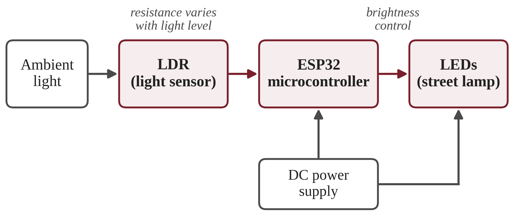
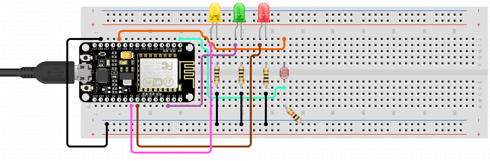

# Environmental Light Intensity Dependent Street Lamp

A street lamp that adjusts its own brightness to the ambient light around it. A light dependent resistor (LDR) senses the light level, an ESP32 microcontroller reads it, and the lamp's LEDs are brightened or dimmed accordingly, so energy is used only when the light is actually needed.

Project for **Analog Circuits (UES301)**, Electrical Engineering, Thapar Institute of Engineering & Technology (TIET), Patiala, July–December 2024.

**Supervisor:** Dr. Sangeeta Kamboj, Assistant Professor (EIED)

## How it works



1. Ambient light falls on the LDR, whose resistance decreases as light increases.
2. The ESP32 reads the resulting signal and decides the LED brightness.
3. As ambient light falls the LEDs are brightened; as natural light rises they are dimmed or switched off.
4. A DC supply powers both the ESP32 and the LEDs. The ESP32's Wi-Fi leaves room for later IoT / smart-city integration.

## Hardware

| Component | Role |
|---|---|
| Light dependent resistor (LDR) | Senses ambient light |
| ESP32 microcontroller | Reads the sensor and controls LED brightness |
| LEDs (red, green, yellow) | Light sources of the lamp |
| Resistors | LED current limiting and circuit operating levels |
| DC power supply | Powers the ESP32 and LEDs (USB in the diagram) |
| Breadboard and jumper wires | Connections |

## Circuit diagram



## Firmware

`firmware/street_lamp/street_lamp.ino` reads the LDR, smooths the reading, and fades the three LEDs (driven together with PWM) from off in daylight to full brightness in the dark. Brightness changes gradually (about 3 s for a full swing) so the lamp never jumps.

Pins, as wired in the circuit diagram (NodeMCU):

| Signal | Pin |
|---|---|
| LDR divider output | A0 |
| Yellow LED | D6 (GPIO12) |
| Red LED | D5 (GPIO14) |
| Green LED | D2 (GPIO4) |

The LDR divider is 3V3 → LDR → A0 → resistor → GND, and each LED has its own resistor to GND.

**Upload (Arduino IDE):** install the ESP8266 (or ESP32) board package, open `street_lamp.ino`, select *NodeMCU 1.0 (ESP-12E Module)* (or *ESP32 Dev Module*), and upload.

**Calibrate:** open the Serial Monitor at 115200 baud. It prints CSV (`ms,light,target,brightness,duty`). Note the `light` value in your darkest and brightest conditions and set `NIGHT_LEVEL` and `DAY_LEVEL` at the top of the sketch. The CSV can also be pasted into a spreadsheet to plot measured results.

**ESP32 note:** the diagram shows an ESP8266-based NodeMCU board. The sketch also builds for ESP32, but its ESP32 pins (LEDs on GPIO 25, 26, 27; LDR on GPIO 34) are suggestions rather than the diagram's wiring.

## Repository contents

```
.
├── README.md
├── firmware/
│   └── street_lamp/
│       └── street_lamp.ino               # ESP8266 / ESP32 sketch
├── report/
│   └── Street_Lamp_Project_Report.pdf  
└── docs/
    ├── circuit_diagram.png               # breadboard wiring diagram
    └── block_diagram.png                 # system block diagram
```

## Status

- Project report and diagrams: included.
- Firmware: included. The control logic was simulated on a computer; it has not yet been tested on the hardware, and `NIGHT_LEVEL` / `DAY_LEVEL` need calibrating for your LDR and resistor.
